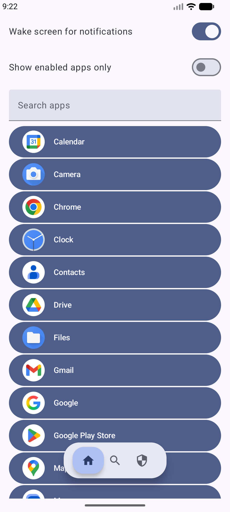
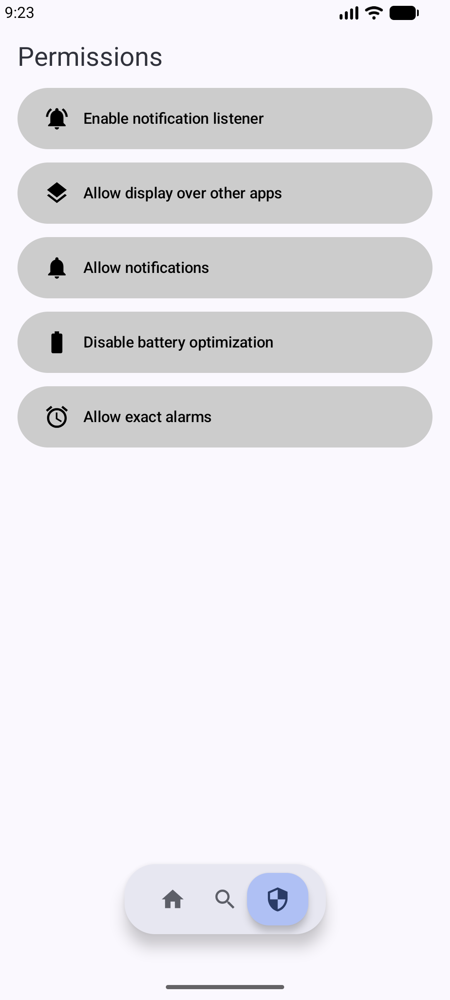
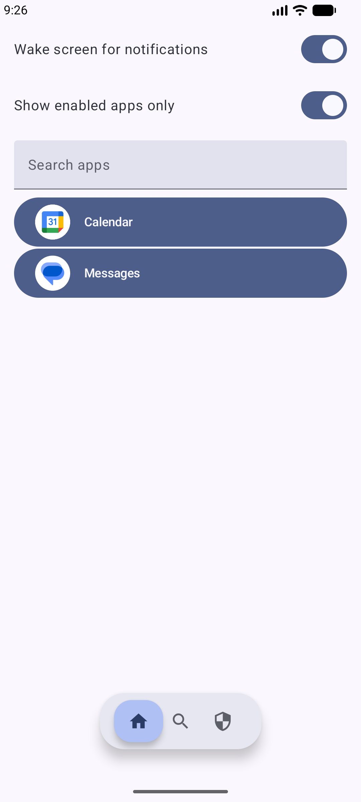
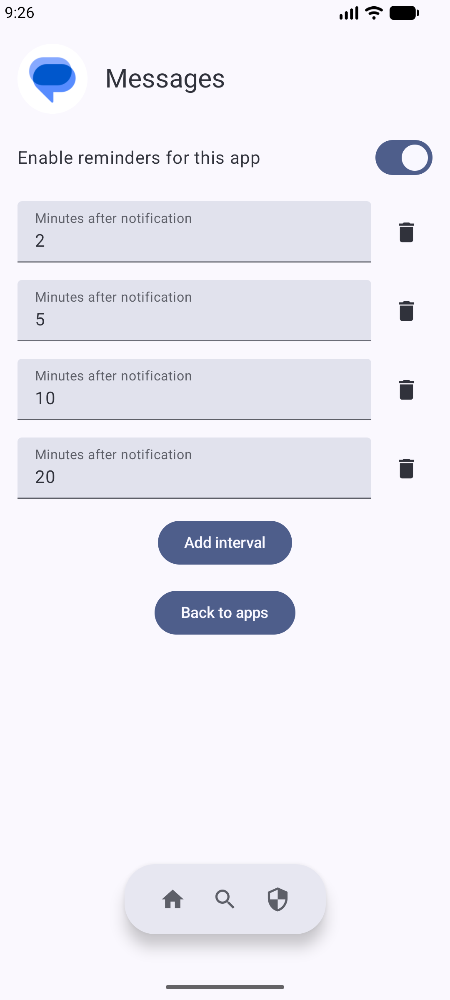
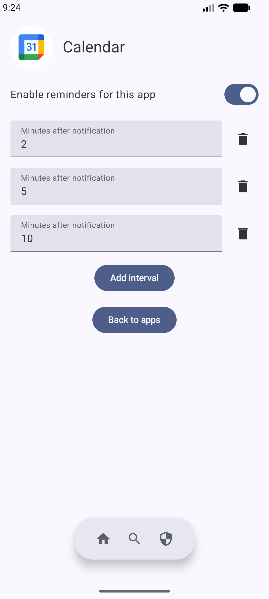

# Remindly - Smart Notification Assistant
Remindly is an Android application designed to enhance your notification experience. It intelligently monitors incoming notifications and performs actions, such as waking the screen, to ensure you don't miss important alerts from specific applications.

## Features
* Smart Screen Wake-Up: Automatically turns the screen on when a notification arrives.
* No Interruption: Wakes the screen without opening the app or interrupting your current task. The device simply lights up, keeping you on the lock screen or in your current app.
* Add reminder notifications to any app with a user-defined number of reminders that automatically cancel once you have read the notification.
* Efficient Background Service: Uses a NotificationListenerService that is optimized for performance. It caches the list of installed applications and only updates it when new apps are installed or removed, saving battery and CPU.
* Modern UI: Built entirely with Jetpack Compose for a modern, reactive, and clean user interface.

## Tech Stack & Architecture

This project is built using modern Android development tools and libraries.

* UI: Jetpack Compose for the entire user interface.
* Core Language: Kotlin (including Kotlin DSL for Gradle scripts).
* Architecture:
    * UI Layer: Composable functions for displaying the app list and permission status.
    * Background Service: A NotificationListenerService to monitor notifications in real-time.
* Key Libraries:
    * Material 3 for Material Design components and icons.
    * Jetpack Compose Navigation for navigating between screens.
    * Lifecycle KTX for observing lifecycle events to keep the UI state fresh.

## Screenshots
<table>
  <tr>
    <td></td>
    <td></td>
    <td></td>
  </tr>
  <tr>
    <td></td>
    <td></td>
  </tr>
</table>
